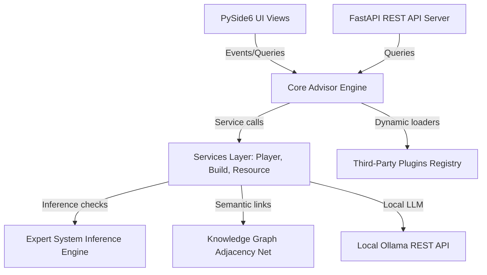

# Warframe Tactical Advisor Developer SDK

Welcome to the Developer SDK for Warframe Tactical Advisor v6.0. This SDK contains the tools, examples, and documentation required to build custom plugins, integrate external apps using our REST API layer, and extend the progression advice systems.

## Architecture Topology

## Contents
* [plugin_documentation.md](plugin_documentation.md) - Learn how to build directory-structured marketplace plugins.
* [api_documentation.md](api_documentation.md) - Integration documentation for the local REST API server.
* `examples/sample_plugin` - A complete sample plugin implementing custom weapons, builds, and commands.
