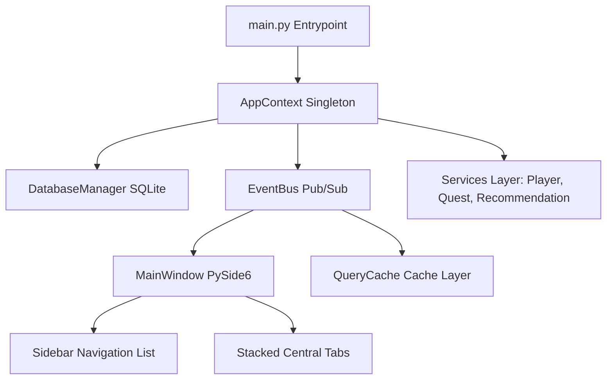

# Warframe Tactical Advisor — Architecture Guide

Welcome to the Developer Architecture Guide for Warframe Tactical Advisor v11.0.

## System Core Abstractions

### 1. Application Context (`AppContext`)
- File: `src/core/app_context.py`
- Serves as the central dependency injector and config provider. Holds instances of active engines and singleton services.

### 2. Event Bus (`EventBus`)
- File: `src/core/event_bus.py`
- Mediates asynchronous communication via standard Pub/Sub events (e.g., `PROFILE_UPDATED`, `NOTIFICATION`, `PLUGINS_LOADED`, `ACCOUNT_SWITCHED`).

### 3. Caching Layer (`QueryCache`)
- File: `src/core/query_cache.py`
- Memory-resident, thread-safe cache dictionary with TTL expiration logic. Improves database loading efficiency.

### 4. Database Layer (`DatabaseManager`)
- File: `src/database/database.py`
- Connects to `warframe.db` via standard SQLite. Implements Schema v2 schema updates.

---

## Technical Recommendations
- Keep all network/IO requests in worker threadpools (like `PluginWorker`) using Pyside6 `QThreadPool`.
- Invalidate caches on mutation events via `PROFILE_UPDATED` event bus notifications.
